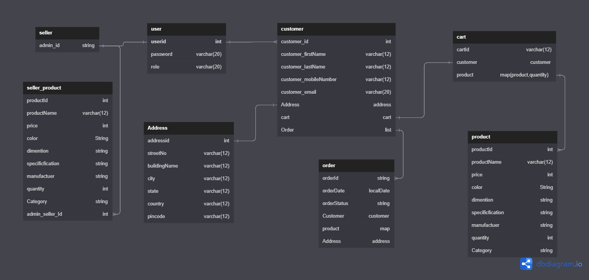

<!-- ============================================  TITLE ======================================================  -->
# A RESTful API Service for an Online Shopping Application

<!-- ============================================  DETAILS ======================================================  -->

<li>A Collabrative Project built by a team of 5 members. Depicting the implementation of an E-Commerce Websites.
<li>The REST API performs all the fundamental CRUD operations and business logics of any Online Shopping Application with user authentication at every API endpoint.
<br>
 
<!-- ============================================  FEATURES ======================================================  -->
## Features

* User Authentication & Validation with session uuid token
* Admin Features:
    * Add, Update, Delete Products from database
    * Check and Resolve order related issues 
* Customer Features:
    * Sign up, Login to get the valid session token
    * Update Profile Details
    * View Products
    * Sort products by category 
    * Add, Update, Delete Products from cart
    * View, Place orders

<!-- ============================================  TECH STACK ======================================================  -->

## Tech Stack

* Java
* Spring Framework
* Spring Boot
* Spring Data JPA
* Hibernate
* MySQL
* Postman
* Swagger UI

<!-- ============================================  MODULES ======================================================  -->

## Modules

* Login Module
* Customer Module
* Products Module
* Order Module
* Cart Module

<!-- ============================================  ER - DIAGRAM ======================================================  -->

# ER Diagram

The following Diagram depicts the flow of our Entity Relation Diagram to simplify the work flow.
<br>
<br>

<br>
<br>

<!-- ============================================  INSTALLATION AND RUN ======================================================  -->

## Installation & Run

* Before running the API server, you should update the database config inside the [application.properties](E-Commerce-Backend\src\main\resources\application.properties) file. 
* Update the port number, username and password as per your local database config.

```
    server.port=8888

    spring.datasource.url=jdbc:mysql://localhost:3306/sb201db;
    spring.datasource.driver-class-name=com.mysql.cj.jdbc.Driver
    spring.datasource.username=root
    spring.datasource.password=123456789

```

<!-- ============================================  API ROOT ENDPOINTS ======================================================  -->

## Deployed Link

<ul><li><a target="_blank" href="http://onlineshop-env.eba-cxymjmdv.ap-northeast-1.elasticbeanstalk.com/swagger-ui/">Live Project Link</a></li></ul>
  
<!-- ============================================  CONTRIBUTORS ======================================================  -->
## Our Team Members 👨‍💻
  - **[@Yash Bhatter](https://github.com/Bhatteryash)**
  - **[@Rohit Roy](https://github.com/Rohit-M-Roy)**
  - **[@Rohit Kapade](https://github.com/rohitkapade)**
  - **[@Humam](https://github.com/humamul)**
  - **[@Sai Datta Reddy](https://github.com/SDR01)**

